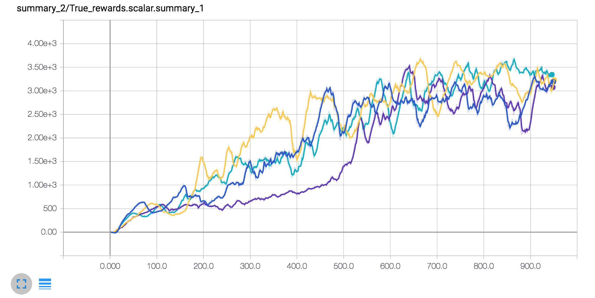

# gail-tf
Tensorflow implementation of Generative Imitation Adversarial Learning

**disclaimers**: some code is borrowed from openai/baselines

## What's GAIL?
- model free imtation learning -> low sample efficiency in training time
  - model-based GAIL: End-to-End Differentiable Adversarial Imitation Learning
- Directly extract policy from demonstrations
- Remove the RL optimization from the inner loop od inverse RL
- Some work based on GAIL:
  - Inferring The Latent Structure of Human Decision-Making from Raw Visual Inputs
  - Multi-Modal Imitation Learning from Unstructured Demonstrations using Generative Adversarial Nets
  - Robust Imitation of Diverse Behaviors
  
## requirement
- python==3.5.2
- mujoco-py==0.5.7
- tensorflow==1.1.0
- gym==0.9.3

## Run the code
I separate the code into two parts: (1) Sampling expert data, (2) Imitation learning with GAIL

### Sampling expert data

- Train expert policy using PPO, from openai/baselines

```bash
cd $GAIL-TF/baselines/ppo1
python run_mujoco.py --env_id $ENV_ID-v1
```
The trained model will save in ```./checkpoint```

- Do sampling from expert policy
```bash
# if use determinsitic policy to sample
python run_mujoco.py --env_id $ENV_ID --task sample_trajectory --load_model_path $PATH_TO_CKPT
# if use stochastic policy to sample
python run_mujoco.py --env_id $ENV_ID --sample_stochastic --task sample_trajectory --load_model_path $PATH_TO_CKPT
```

This will generate a pickle file that store the expert trajectories in ```./XXX.pkl``` (eg. deterministic.ppo.Hopper.0.00.pkl)

### Imitation learning via GAIL

```bash
cd $GAIL-TF
python main.py --env_id $ENV_ID --expert_path $PICKLE_PATH
```

Meaning of some flags are defined as:

```
--env_id:          The environment id
--num_cpu:         Number of CPU available during sampling
--expert_path:     The path to the pickle file generated in the [previous section]()
--traj_limitation: Limitation of the exerpt trajectories
--g_step:          Number of policy optimization steps in each iteration
--d_step:          Number of discriminator optimization steps in each iteration
--num_timesteps:   Number of timesteps to train (limit the number of timesteps to interact with environment)
```

## Results
Note: The following hyper-parameter setting is the best that I've tested (simple grid search on setting with 1500 trajectories), just for your information.

The different curves below correspond to different expert size (1000,100,10,5).

- Hopper-v1 (Average total return of expert policy: 3589)

```bash
python main.py --env_id Hopper-v1 --expert_path baselines/ppo1/deterministicppo.Hopper.0.00.pkl --g_step 3 --adversary_entcoeff 0
```


- Walker-v1 (Average total return of expert policy: 4392)

```bash
python main.py --env_id Walker2d-v1 --expert_path baselines/ppo1/deterministicppo.Walker2d.0.00.pkl --g_step 3 --adversary_entcoeff 1e-3
```



- HalhCheetah-v1 (Average total return of expert policy: 2110)

For HalfCheetah-v1 and Ant-v1, using behavior cloning is needed:
```bash
python main.py --env_id HalfCheetah-v1 --expert_path baselines/ppo1/deterministicppo.HalfCheetah.0.00.pkl --pretrained True --BC_max_iter 10000 --g_step 3 --adversary_entcoeff 1e-3
```


**You can find more details [here](https://github.com/andrewliao11/gail-tf/blob/master/misc/exp.md) and GAIL policy [here](https://drive.google.com/drive/folders/0B3fKFm-j0RqeN2VTTU8tc19UVk0?usp=sharing)**

## TODO 
- Evaluation code

## Reference
- Generative adversarial imitation learning
- openai/imitation
- openai/baselines
